# tutorial-montagem-pc
Tutorial de montagem e desmontagem de computadores.

# 🖥️ Tutorial: Desmontagem e Montagem de um Computador Desktop

> Documentação da prática de hardware, em formato de tutorial passo a passo, para quem quer aprender como um PC desktop é desmontado e montado novamente.

**Integrantes:** _Marília_ e _Ian_

**Curso:** Técnico em Informática

---

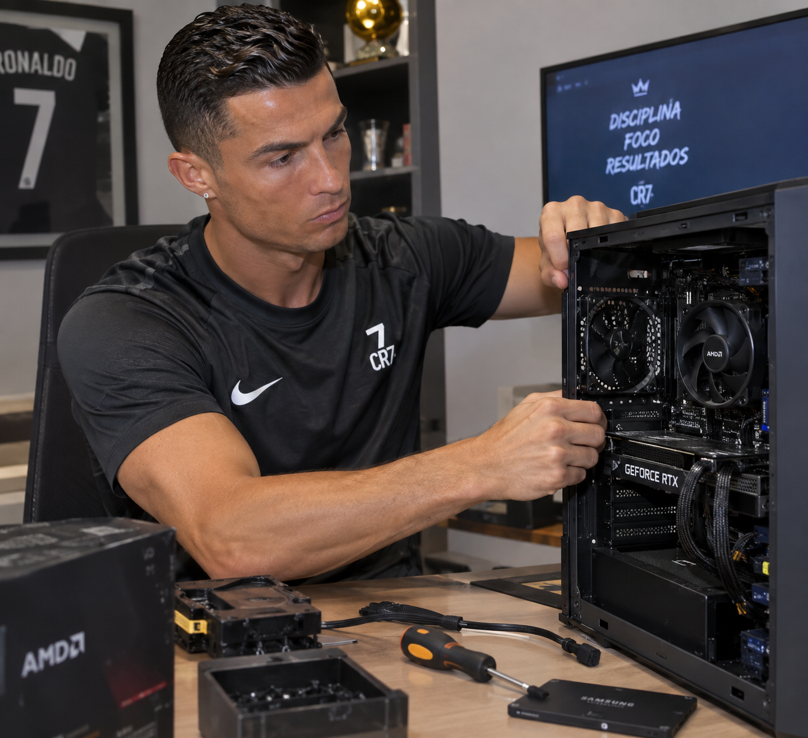

---

## 📑 Sumário

1. [Introdução](#-introdução)
2. [Ferramentas utilizadas](#-ferramentas-utilizadas)
3. [Componentes envolvidos](#-componentes-envolvidos)
4. [Cuidados antes de começar](#-cuidados-antes-de-começar)
5. [Passo a passo da desmontagem](#-passo-a-passo-da-desmontagem)
6. [Passo a passo da montagem](#-passo-a-passo-da-montagem)
7. [Considerações finais](#-considerações-finais)

---

## 📌 Introdução

Esta página documenta a aula prática de **desmontagem e montagem de um computador desktop**. Aqui você encontra a lista de ferramentas e componentes usados, a sequência correta para desmontar cada peça e a ordem para remontar o equipamento, com fotos de cada etapa.

Saber a ordem certa evita danos às peças, perda de parafusos e conexões erradas. O tutorial serve tanto para quem quer fazer manutenção quanto para quem quer montar o próprio computador.

<!-- 📷 FOTO DA INTRODUÇÃO: foto geral do computador e das ferramentas sobre a bancada (sem rostos) -->
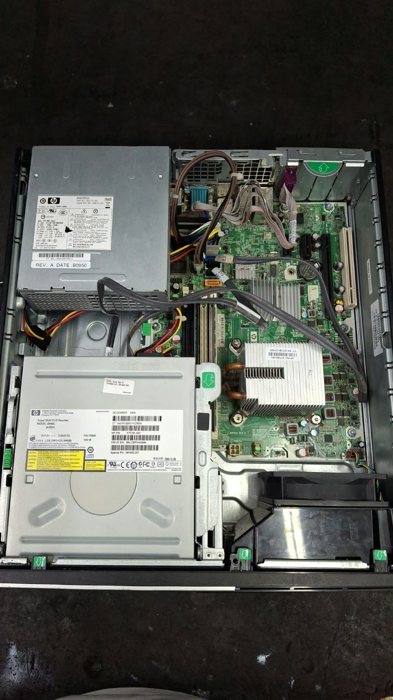

---

## 🧰 Ferramentas utilizadas

- **Multímetro**
- **Kit de chaves fenda e Phillips, conjunto profissional de 9 peças.** O kit pode ser comprado pronto ou as peças podem ser compradas separadamente:
  - Chave de fenda 3/16”
  - Chave de fenda 1/8”
  - Chave Phillips #1
  - Chave Phillips #0
  - Extrator de CI
  - Chave de torque T15
  - Chave de fenda soquete 1/4”
  - Chave de fenda soquete 3/16”
  - Chave teste
  - Tubo para acessórios e componentes
- **Pinça**
- **Alicate de bico longo**
- **Pincel** para limpeza dos componentes

<!-- 📷 FOTO DAS FERRAMENTAS: ferramentas organizadas sobre a bancada -->
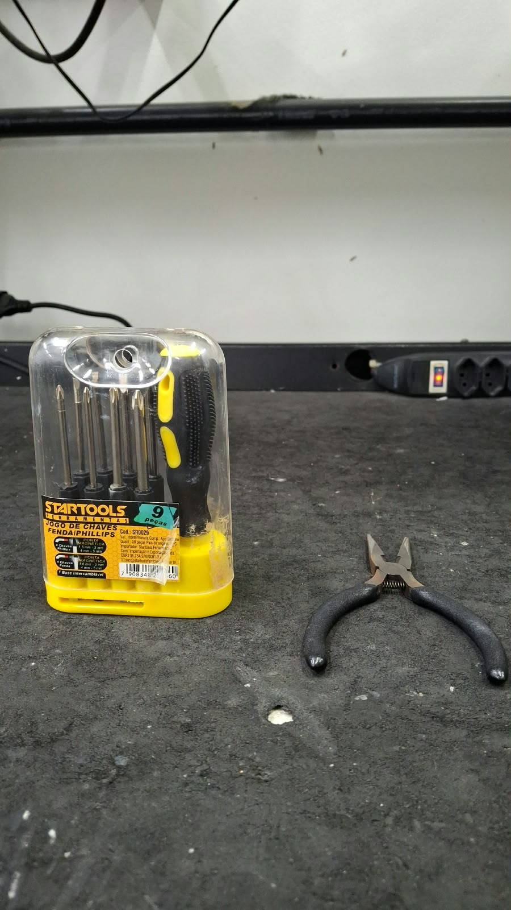

---

## 🔩 Componentes envolvidos

- Gabinete
- Fonte de alimentação
- Placa-mãe
- Processador
- Dissipador de calor e ventoinha (cooler)
- Memória RAM
- Placa de vídeo (e outras placas de expansão, se houver)
- Unidades de armazenamento (HDD, SSD, unidade óptica)
- Cabos de dados, cabos flat e conectores do gabinete

<!-- 📷 FOTO DOS COMPONENTES: componentes organizados lado a lado -->
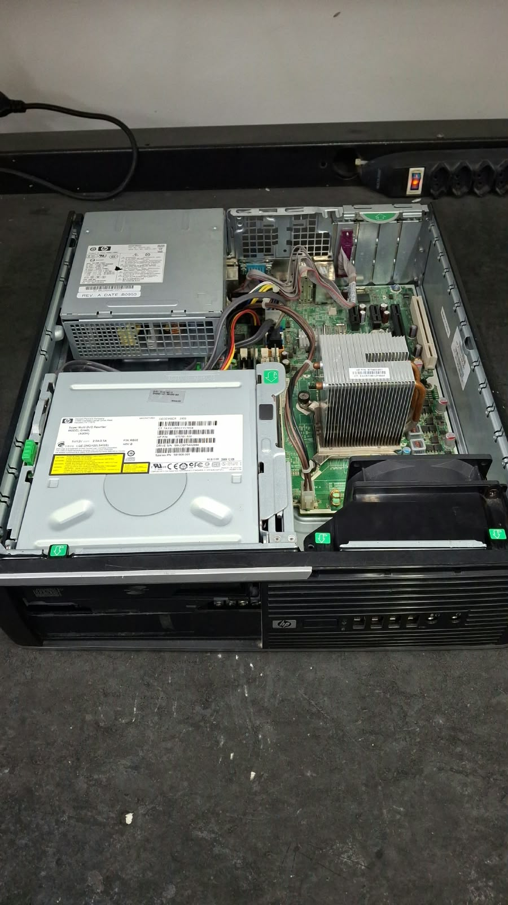

---

## ⚠️ Cuidados antes de começar

- Trabalhe com o computador **desligado e fora da tomada**.
- Descarregue a eletricidade estática tocando em uma parte metálica do gabinete antes de mexer nas peças.
- Use uma bancada limpa e bem iluminada.
- Guarde os parafusos em um recipiente, separados por tipo, para não misturar na hora de remontar.
- Tire fotos dos cabos e conectores antes de desconectar, para facilitar a remontagem.
- Segure as placas pelas bordas e nunca force um encaixe.

---

## 🔧 Passo a passo da desmontagem

### Etapa 1: Desligar o computador e desconectar tudo

Desligue o computador e desconecte todos os cabos e periféricos, como mouse, teclado, monitor e impressora.

<!-- 📷 FOTO ETAPA 1 -->

### Etapa 2: Remover a tampa do gabinete

Remova os parafusos que prendem a tampa lateral do gabinete e retire a tampa para acessar as peças internas.

<!-- 📷 FOTO ETAPA 2 -->
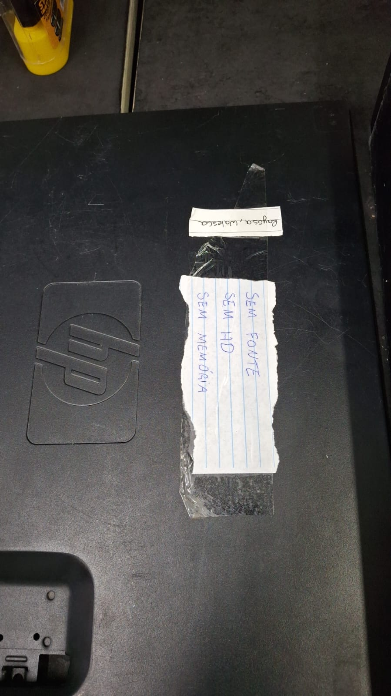

### Etapa 3: Desconectar os conectores da fonte de alimentação

Desconecte da placa-mãe, das unidades de armazenamento e das placas todos os cabos que vêm da fonte.

<!-- 📷 FOTO ETAPA 3 -->
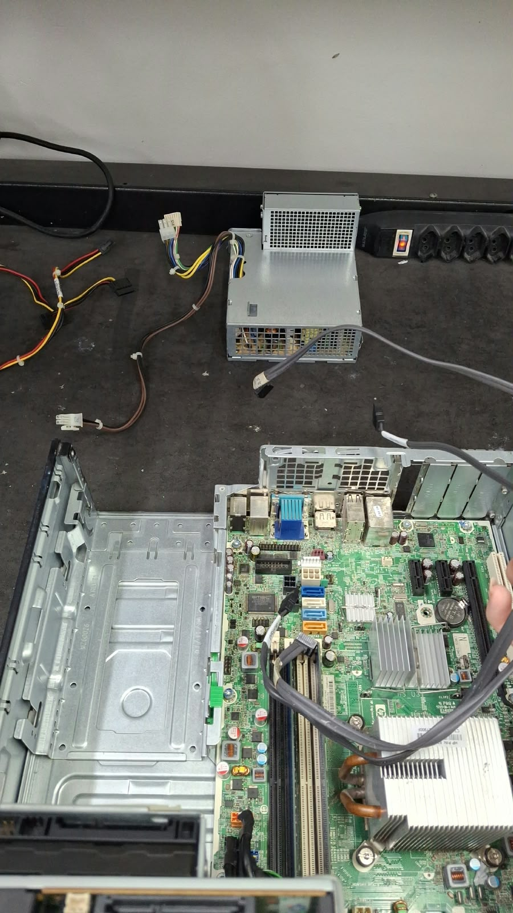

### Etapa 4: Retirar a fonte de alimentação do gabinete

Solte os parafusos que prendem a fonte na traseira do gabinete e retire-a com cuidado.

<!-- 📷 FOTO ETAPA 4 -->

### Etapa 5: Desinstalar as placas de vídeo e de som off-board

Se houver, solte o parafuso que prende a placa à traseira do gabinete e retire-a puxando com cuidado para cima, soltando a trava do encaixe.

<!-- 📷 FOTO ETAPA 5 -->
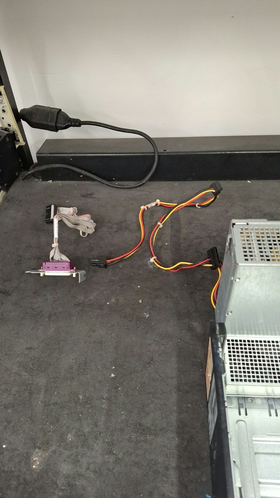

### Etapa 6: Desinstalar outras placas conectadas à placa-mãe

Retire qualquer outra placa de expansão (rede, captura etc.) que estiver encaixada na placa-mãe, se houver.

<!-- 📷 FOTO ETAPA 6 -->
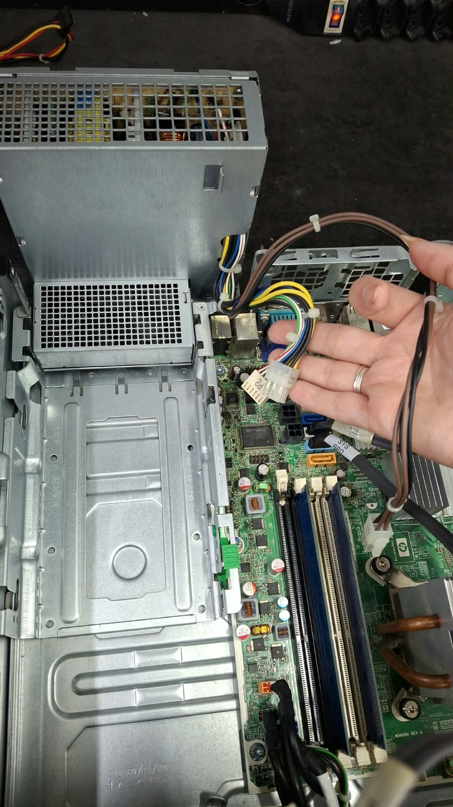

### Etapa 7: Desconectar os conectores do gabinete na placa-mãe

Desconecte os fios do painel frontal: botão liga/desliga, reset, LEDs, USB e áudio. _Essa etapa vale para gabinetes ATX e ITX._

<!-- 📷 FOTO ETAPA 7 -->
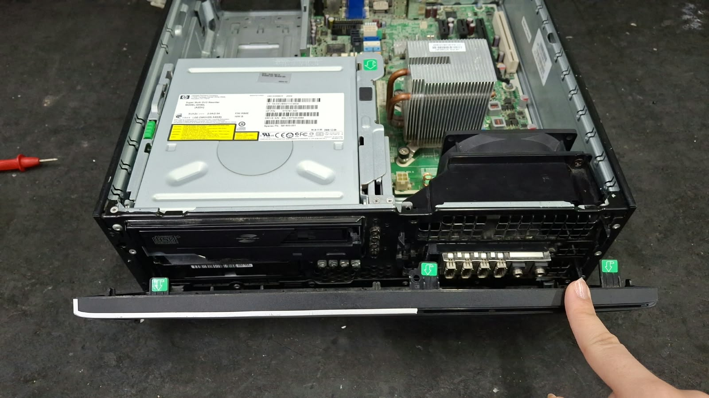

### Etapa 8: Desconectar os cabos de dados

Retire os cabos de dados (SATA, flat etc.) que ligam as unidades de armazenamento à placa-mãe.

<!-- 📷 FOTO ETAPA 8 -->
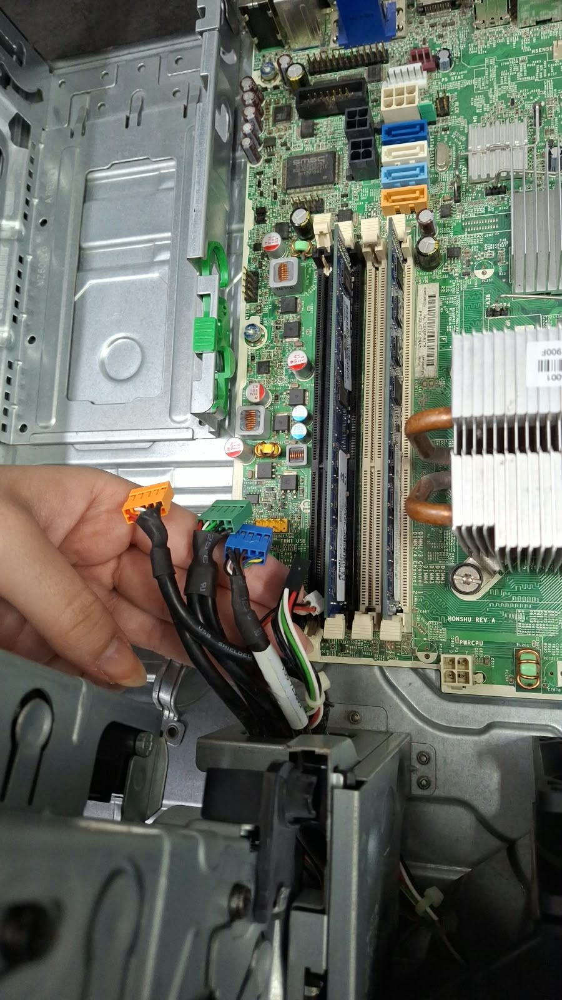

### Etapa 9: Desafixar as unidades de armazenamento secundário

Solte os parafusos ou as travas e retire HDDs, SSDs e dispositivos ópticos do gabinete.

<!-- 📷 FOTO ETAPA 9 -->
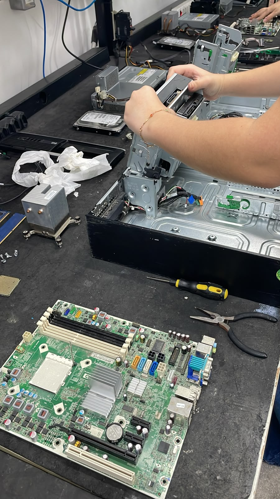

### Etapa 10: Desinstalar a memória RAM

Abra as travas laterais do slot e puxe o módulo de memória para cima, segurando pelas bordas.

<!-- 📷 FOTO ETAPA 10 -->
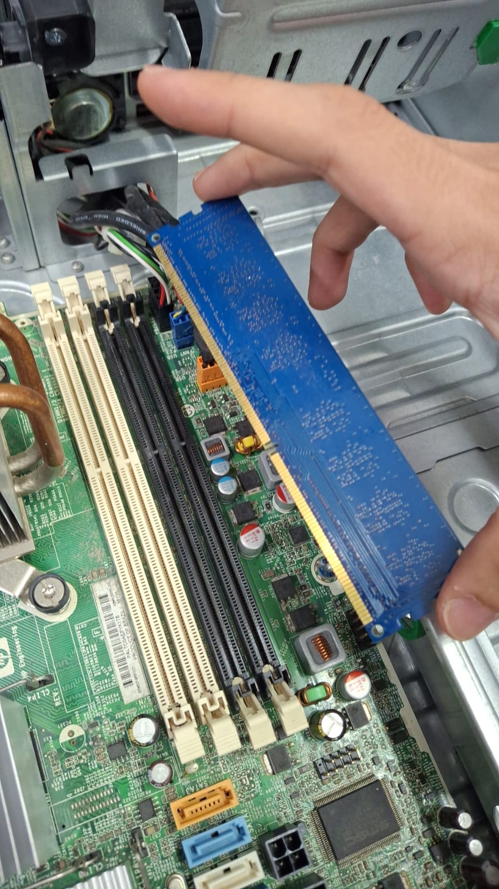

### Etapa 11: Desinstalar o dissipador de calor e a ventoinha do processador

Desconecte o cabo do cooler da placa-mãe, solte as travas ou parafusos e retire o conjunto com cuidado.

<!-- 📷 FOTO ETAPA 11 -->
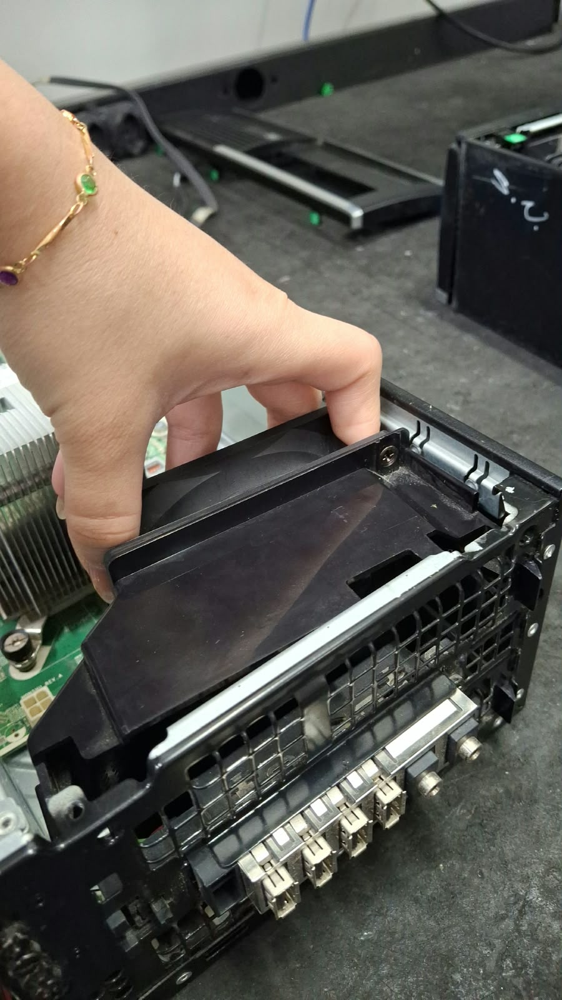

### Etapa 12: Desinstalar o processador

Levante a alavanca de fixação do soquete e retire o processador na vertical, sem tocar nos contatos.

<!-- 📷 FOTO ETAPA 12 -->
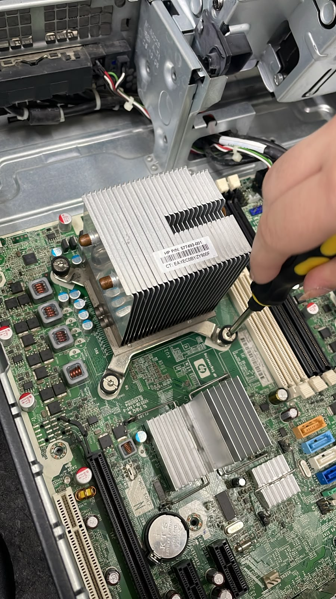

### Etapa 13: Desafixar a placa-mãe do chassi metálico

Remova os parafusos que prendem a placa-mãe ao gabinete e retire-a com cuidado.

<!-- 📷 FOTO ETAPA 13 -->
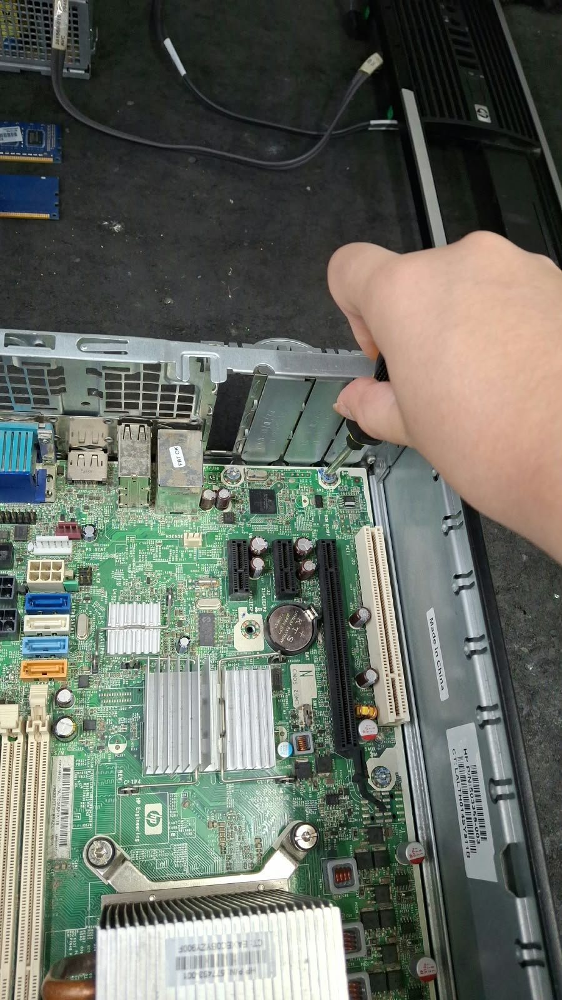

### Etapa 14: Realizar a limpeza

Com o pincel, remova a poeira do gabinete, do cooler, das peças e dos conectores.

<!-- 📷 FOTO ETAPA 14 -->
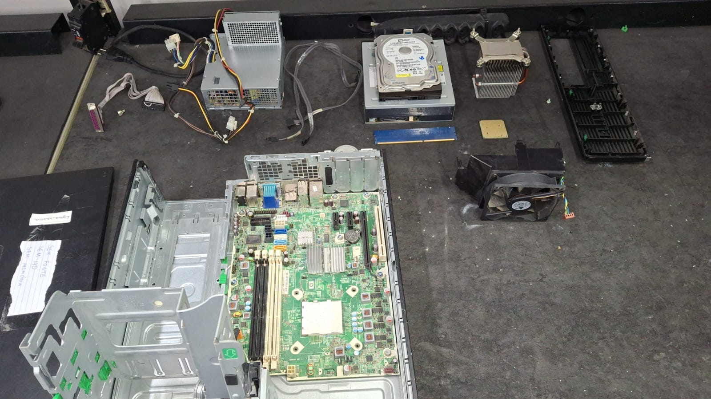

---

## 🔨 Passo a passo da montagem

### Etapa 1: Preparar o gabinete

Verifique se o gabinete está em boas condições e se possui:

- Parafusos para fixação da placa-mãe
- Parafusos para fixação da fonte de alimentação
- Parafusos para fixação das unidades de armazenamento
- Parafusos para fixação das placas de expansão
- Conectores para os botões de liga/desliga e reset
- Conectores para os LEDs de atividade
- Conectores para áudio e vídeo, se houver
- Conectores para as portas USB

<!-- 📷 FOTO ETAPA 1 -->

### Etapa 2: Fixar a placa-mãe no chassi metálico

Posicione a placa-mãe sobre os espaçadores do gabinete e fixe-a com os parafusos.

<!-- 📷 FOTO ETAPA 2 -->

### Etapa 3: Instalar os conectores do gabinete na placa-mãe

Conecte os fios do painel frontal (liga/desliga, reset, LEDs, USB e áudio) nos pinos indicados no manual da placa-mãe.

<!-- 📷 FOTO ETAPA 3 -->

### Etapa 4: Conectar os periféricos on-board

Conecte os conectores dos barramentos externos da placa-mãe.

<!-- 📷 FOTO ETAPA 4 -->

### Etapa 5: Instalar o processador

Levante a alavanca do soquete, encaixe o processador alinhando a marcação do canto e abaixe a alavanca para travar.

<!-- 📷 FOTO ETAPA 5 -->

### Etapa 6: Aplicar a pasta térmica e instalar o dissipador e o cooler

Aplique uma pequena quantidade de pasta térmica sobre o processador, encaixe o dissipador com a ventoinha e conecte o cabo do cooler na placa-mãe.

<!-- 📷 FOTO ETAPA 6 -->

### Etapa 7: Instalar a memória RAM

Alinhe o módulo com o entalhe do slot e pressione até as travas laterais se fecharem.

<!-- 📷 FOTO ETAPA 7 -->

### Etapa 8: Instalar a placa de vídeo

Encaixe a placa no slot de expansão, pressione até travar e fixe-a na traseira do gabinete com o parafuso.

<!-- 📷 FOTO ETAPA 8 -->

### Etapa 9: Fixar as unidades de armazenamento secundário

Instale SSDs, HDDs e unidades ópticas nas baias do gabinete e fixe-os com parafusos.

<!-- 📷 FOTO ETAPA 9 -->

### Etapa 10: Instalar a fonte de alimentação

Posicione a fonte no gabinete e fixe-a com os parafusos na traseira.

<!-- 📷 FOTO ETAPA 10 -->

### Etapa 11: Instalar os conectores da fonte de alimentação

Conecte os cabos da fonte na placa-mãe, nas unidades de armazenamento e nas placas que precisarem de energia.

<!-- 📷 FOTO ETAPA 11 -->

### Etapa 12: Instalar os cabos flat

Conecte os cabos flat e de dados entre a placa-mãe e as unidades de armazenamento.

<!-- 📷 FOTO ETAPA 12 -->
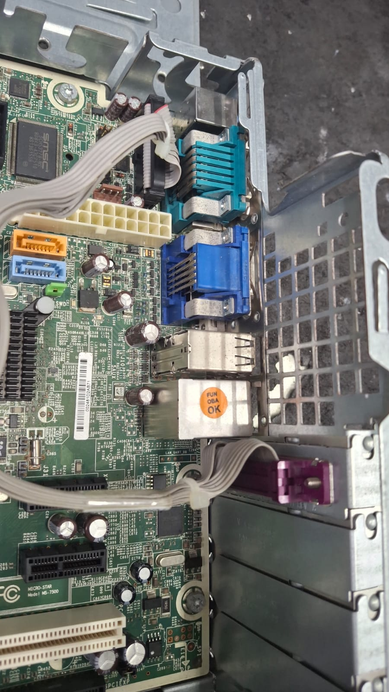

### Etapa 13: Instalar os demais periféricos

Instale os demais periféricos internos, caso existam.

<!-- 📷 FOTO ETAPA 13 -->

### Etapa 14: Instalar mouse, teclado e monitor

Conecte o mouse, o teclado e o monitor de vídeo na parte traseira do gabinete.

<!-- 📷 FOTO ETAPA 14 -->

### Etapa 15: Conferir tudo

Antes de ligar, confira:

- A tensão da fonte de alimentação (110 V ou 220 V, conforme a tomada)
- O estabilizador, se houver
- Se a tomada tem aterramento
- Se todos os cabos estão firmes e nenhum parafuso ficou solto dentro do gabinete

<!-- 📷 FOTO ETAPA 15 -->

### Etapa 16: Ligar o PC pela primeira vez

Conecte o cabo de energia, ligue o computador e verifique se ele inicia normalmente.

<!-- 📷 FOTO ETAPA 16 -->

---

## ✅ Considerações finais

A prática mostrou que desmontar e montar um computador exige atenção à ordem das etapas, cuidado com as peças e organização dos parafusos e cabos. Seguindo a sequência deste tutorial, o processo se torna seguro e mais fácil de repetir.

<!-- 📷 FOTO FINAL: computador montado e funcionando (sem rostos) -->

---

  
🖥️ Tutorial produzido como atividade prática do curso Técnico em Informática no Instituto Federal da Paraíba (IFPB).

